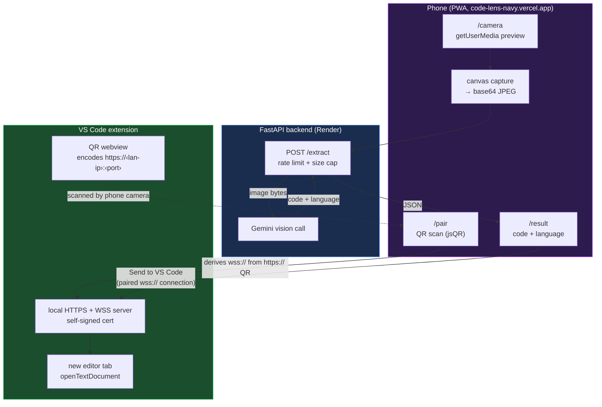

# CodeSnap

Point your phone's camera at code — a screen, a whiteboard, a textbook — and get it back as clean, selectable text. Optionally send it straight into a VS Code editor tab without touching a keyboard.

**Live app:** https://code-lens-navy.vercel.app

## What it is

CodeSnap is a photo-to-code extraction tool built as an installable phone PWA, backed by a rate-limited FastAPI server that calls Gemini's vision model, with an optional VS Code extension that receives the extracted code directly over a local WebSocket connection.

It's a clean rebuild: the previous version of this project was AI-generated end to end and I couldn't defend a single line of it in an interview. This one I built and can explain file by file — see [Architecture](#architecture) and [Design decisions](#design-decisions) below.

## Try it

1. Open https://code-lens-navy.vercel.app on your phone.
2. Tap **Open camera**, point it at some code, tap **Capture**, then **Extract code**.
3. The extracted code and detected language show up, with a copy button.
4. Optionally: run the VS Code extension (see [Extension setup](#extension-setup)), tap **Pair with VS Code**, scan the QR code it shows, then tap **Send to VS Code** from the result screen.

## Stack, with reasoning

| Layer | Choice | Why |
|---|---|---|
| Frontend | React + TypeScript + Vite | This is a client-side camera app with no pages to server-render and no SEO surface — a meta-framework like Next.js would add routing/data-fetching machinery this app doesn't use. Vite gives fast HMR and a plain SPA build; React Router handles the three real routes directly. |
| Backend | Python + FastAPI + Uvicorn | FastAPI turns the request/response Pydantic models directly into validation and an interactive `/docs` UI for free, which is genuinely how `/extract` got tested during development. |
| Vision model | Gemini (`gemini-3.6-flash`) via `google-genai`, free tier | A multimodal model reads code structure (indentation, brackets, comments) far better than plain OCR, which just sees glyphs. Free tier means the constraint is rate limits, not billing — see [Known limitations](#known-limitations). |
| Backend host | Render (free tier) | Deploys straight from a `render.yaml` blueprint with no extra config; free tier sleeps after inactivity, which is an acceptable tradeoff for a portfolio demo (see limitations). |
| Frontend host | Vercel | Static hosting with HTTPS by default and zero config for a Vite build — HTTPS is a hard requirement for `getUserMedia` on a phone, not a nice-to-have. |
| Extension pairing | Self-signed `wss://` + QR | Explained in full under [Design decisions](#design-decisions). |

## Architecture

Two independent data flows share the same backend and frontend camera code, but never touch each other directly.



**Extraction flow** (solid path through `backend`): the phone captures a frame to a canvas, downscales it, and POSTs it as a base64 JPEG to `POST /extract`. FastAPI decodes and size-checks the image, sends it to Gemini with an extraction prompt, and returns `{code, language}` as validated JSON via a Pydantic response model. The rate limiter and size cap sit in front of the Gemini call specifically to protect the shared free-tier quota (see [Known limitations](#known-limitations)).

**Pairing flow** (dashed path through `vscode`): this never touches the backend or the internet. The extension runs its own local HTTPS+WebSocket server on your LAN, secured with a self-signed certificate generated once and cached per machine. It shows a QR code encoding its own `https://` address. The phone scans that QR using the same camera hook the extraction flow uses, derives a `wss://` URL from it, and stores the pairing. From the result screen, "Send to VS Code" opens that WebSocket, sends the extracted code and language as JSON, and the extension opens it in a new editor tab.

## Design decisions

**1. The Gemini key lives only on the backend, behind a rate limiter.**
The frontend never sees the API key — it only ever talks to our own `/extract` endpoint. If the key were embedded in frontend code, anyone could pull it out of the built JS bundle and drain (or abuse) the quota. `POST /extract` also carries its own two-tier rate limit (8/minute global, 20/day per IP) independent of whatever Gemini itself enforces, because a public URL will get hit by more than just me, and the free-tier daily quota is shared across every visitor.

**2. Vite + React Router over a meta-framework.**
This app has three routes, no server-rendered content, and no SEO surface — everything happens after `getUserMedia` grants camera access, which only works client-side anyway. Next.js's data-fetching and server-rendering model would be solving problems this app doesn't have. Vite gives a fast dev loop and a plain static SPA build that Vercel serves as-is.

**3. The VS Code extension talks to the phone over `wss://` with a self-signed certificate, not plain `ws://`.**
The deployed PWA is HTTPS (a hard requirement for camera access on a phone), and browsers block a plain `ws://` connection from an HTTPS page as mixed content — there's no way around this that keeps the phone-to-laptop connection direct and local. The tradeoff is a one-time certificate-trust step in the phone's browser the first time you pair on a given network; the alternative (relaying through a public server) would avoid that step but move a local-network feature onto internet infrastructure for no real benefit, and stray from what this project set out to teach: a real getUserMedia → WebSocket → editor pipeline end to end.

## Known limitations

- **OCR/extraction accuracy drops on poor photos.** Glare, steep angles, low light, or dense small text all measurably hurt Gemini's transcription accuracy. This is a vision-model limitation, not something the prompt can fully correct for.
- **The Gemini free tier is genuinely limiting.** 10 requests/minute and 250/day, shared across every visitor to the deployed app (see [aistudio.google.com/rate-limit](https://aistudio.google.com/rate-limit) for current numbers). `/extract`'s own rate limit sits under that ceiling, but on a busy day the app will hit 429s.
- **The Render free tier sleeps after inactivity.** The first request after a while can take 30-60 seconds to wake the backend up. Fine for a portfolio demo, not for anything real.
- **No auth on the VS Code extension's pairing server.** Anyone who can reach the LAN address and has trusted (or clicked through) the self-signed certificate can send code into your editor. Acceptable for a local, single-user dev tool; not something to expose beyond your own LAN.
- **Detected language names don't always map to a VS Code language id.** Gemini returns human-readable names ("TypeScript JSX"); the extension maps the common ones to real VS Code language ids for syntax highlighting, but an unrecognised name falls back to plain text.
- **No persistent pairing across extension restarts beyond the cached cert.** If the extension restarts on a different network (different LAN IP), you'll need to re-pair and re-trust the certificate.

## Local setup

### Backend
1. `cd backend && python -m venv .venv && .venv\Scripts\activate` (or `source .venv/bin/activate` on macOS/Linux)
2. `pip install -r requirements.txt`
3. Get a free API key from [Google AI Studio](https://aistudio.google.com/apikey) and put it in `backend/.env` (gitignored):
   ```
   GEMINI_API_KEY=your-key-here
   ```
4. `uvicorn main:app --reload --port 8000`

### Frontend
1. `cd codesnap && npm install`
2. `.env.local` already points `VITE_API_BASE_URL` at `http://localhost:8000` for local dev
3. `npm run dev`

Camera access needs a secure context (HTTPS, or `localhost`). Plain `http://<lan-ip>:5173` on a phone will NOT be able to open the camera — see Deployment below.

### Extension setup
1. Open the `extension` folder itself as its own VS Code window (not the monorepo root) — `File → Open Folder…` → `extension/`.
2. `npm install`
3. Press `F5` to launch an Extension Development Host.
4. In that window, run **CodeSnap: Pair Device** from the Command Palette.

## Known constraints
- **Gemini free tier rate limits** (model: `gemini-3.6-flash`, as of Jan 2026): 10 requests/minute, 250,000 tokens/minute, 250 requests/day. Limits apply per Google Cloud project, not per API key, and reset at midnight Pacific Time. Check current limits at [aistudio.google.com/rate-limit](https://aistudio.google.com/rate-limit) since Google adjusts these over time.
- **`POST /extract` protections**: rate-limited to 8 requests/minute globally (shared across every caller, kept under Gemini's 10/minute cap) and 20 requests/day per client IP (so no single caller can burn through most of the 250/day quota alone) — both return `429`. Images over 8MB decoded are rejected with `413`.

## Deployment
Camera capture requires HTTPS on a phone, so both sides are deployed rather than served over plain LAN HTTP:

**Backend (Render)**
1. Push this repo to GitHub, then create a new Blueprint on [Render](https://render.com) pointing at it — `render.yaml` at the repo root defines the `codesnap-backend` service (root dir `backend/`, free plan).
2. In the Render dashboard, set the `GEMINI_API_KEY` env var (and `FRONTEND_ORIGINS` once the Vercel URL is known, e.g. `https://your-app.vercel.app`).
3. Render gives you a URL like `https://codesnap-backend.onrender.com`. Note: free-tier services sleep after inactivity, so the first request after a while can take ~30-60s to wake up.

**Frontend (Vercel)**
1. Import this repo into [Vercel](https://vercel.com), set the project's Root Directory to `codesnap`.
2. Set the `VITE_API_BASE_URL` env var to the Render backend URL from above.
3. Deploy, then open the resulting `https://*.vercel.app` URL on your phone — the PWA can be added to the home screen, and the camera works since the page is served over HTTPS.

## Layout
```text
codesnap/
├─ backend/
│  ├─ .venv/
│  ├─ main.py            # FastAPI app, routes, rate limiting, size cap
│  ├─ models.py           # Pydantic request/response models
│  ├─ gemini_client.py    # Gemini call + prompt
│  └─ requirements.txt
├─ codesnap/               # frontend (Vite + React)
│  ├─ src/
│  │  ├─ pages/            # LandingPage, CameraPage, ResultPage, PairPage
│  │  ├─ hooks/            # useCamera, useQrScanner
│  │  ├─ components/       # CodeBlock
│  │  └─ lib/              # api client, pairing/WS client, shared types
│  ├─ package.json
│  └─ vite.config.ts        # includes vite-plugin-pwa manifest + SW config
├─ extension/               # VS Code extension
│  ├─ src/
│  │  ├─ extension.ts       # command registration, orchestration
│  │  ├─ server.ts          # HTTPS + WSS server, message handling
│  │  ├─ certs.ts           # self-signed cert generation/caching
│  │  ├─ pairingPanel.ts    # QR webview
│  │  ├─ network.ts         # LAN IP detection
│  │  └─ languageIds.ts     # Gemini language name → VS Code language id
│  └─ package.json
├─ render.yaml
├─ .gitignore
├─ LICENSE
└─ README.md
```
